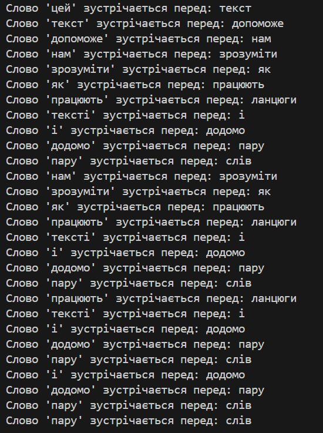

# Аналіз тексту за допомогою ланцюгів біграм

## Опис
Цей проект призначений для аналізу тексту з використанням ланцюгів біграм — пар слів, які зустрічаються послідовно в тексті. Аналіз біграм допомагає визначити, які слова найчастіше йдуть одне за одним, що може бути корисним для лінгвістичного аналізу, моделювання мови або обробки природної мови.

## Мета
Метою є розробка інструменту для генерації біграм з вхідного тексту та вивчення частоти їх появи. Це дозволяє:
- Визначити, як часто певні слова слідують одне за одним.
- Підрахувати кількість унікальних біграм у тексті.
- Отримати список слів, які найчастіше йдуть після конкретних слів.

## Вхідні дані
- **text**: Текстовий рядок, який потрібно проаналізувати. Текст може містити будь-які слова, але для правильного аналізу текст очищається від пунктуації та перетворюється в нижній регістр.

## Вихідні дані
- **Кількість унікальних біграм**: Загальна кількість унікальних пар слів у тексті.
- **Словники співвідношень слів**: Для кожного унікального слова показано слова, які йдуть після нього, що відображає частоту їх співвідношення.
- **Статистика для кожного слова**: Для кожного слова виводиться список слів, що найчастіше слідують за ним у тексті, що може бути корисним для побудови контексту.

## Висновки

1. **Кількість унікальних біграм**:
   - Програма обчислює загальну кількість унікальних біграм у тексті. Це дає змогу побачити, скільки різних пар слів зустрічається в тексті, що може бути індикатором його різноманітності.

2. **Словники співвідношень слів**:
   - Створюється словник, де кожне слово пов'язане зі словами, що йдуть після нього. Це дозволяє зрозуміти контексти, в яких слово використовується, і може бути основою для побудови прогнозувальної моделі для передбачення наступного слова.

3. **Статистика для кожного слова**:
   - Для кожного унікального слова в тексті показано список слів, які часто з'являються після нього. Ця інформація корисна для аналізу зв’язків між словами, а також може допомогти у визначенні ключових тем тексту.

## Результат
При запуску програми користувач отримує:
- Загальну кількість унікальних біграм у тексті.
- Список кожного слова з переліком слів, які найчастіше з'являються після нього.

Проект демонструє базові можливості обробки природної мови, фокусуючись на аналізі частоти двослівних комбінацій та вивченні структури тексту на рівні біграм.
